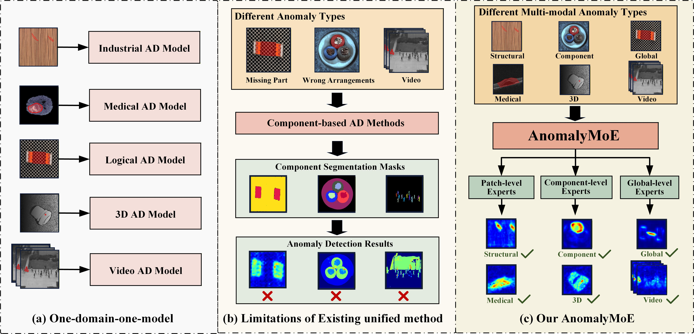

# AnomalyMoE: Towards a Language-free Generalist Model for Unified Visual Anomaly Detection

Official implementation of paper [AnomalyMoE: Towards a Language-free Generalist Model for Unified Visual Anomaly Detection](https://arxiv.org/abs/2508.06203) (AAAI 2026).

## Introduction

Welcome to the official repository for "AnomalyMoE: Towards a Language-free Generalist Model for Unified Visual Anomaly Detection." This project introduces AnomalyMoE, a novel and universal framework designed to unify visual anomaly detection across a wide array of domains and modalities. Our approach addresses the critical limitations of existing methods, which are often highly specialized and struggle to generalize. AnomalyMoE provides a single, generalist model capable of handling diverse anomaly types without relying on external language priors.

The core insight behind AnomalyMoE is to reconceptualize the complex anomaly detection task by decomposing it into a three-level semantic hierarchy. This hierarchy ranges from local structural anomalies, such as fine-grained textural defects, to component-level semantic anomalies involving errors in specific object parts, and finally to global logical anomalies characterized by errors in overall arrangement or behavior. To tackle this multi-faceted problem, AnomalyMoE leverages a powerful Mixture-of-Experts (MoE) architecture with three distinct groups of specialized experts. Patch-level experts focus on reconstructing fine-grained features to detect structural flaws, Component-level experts identify semantic errors by modeling normal object parts, and Global-level experts recognize logical inconsistencies by learning holistic scene representations.

To ensure the robustness and efficiency of the MoE architecture, our framework is enhanced by two novel auxiliary modules. The Expert Information Repulsion (EIR) module promotes functional diversity and specialization by minimizing informational overlap between experts. Concurrently, the Expert Selection Balancing (ESB) module guarantees that all experts are utilized effectively during training, preventing model collapse and maximizing the model's overall capacity.

Our extensive experiments on 8 challenging datasets—spanning industrial imaging, 3D point clouds, medical imaging, video surveillance, and logical anomaly detection—demonstrate that AnomalyMoE establishes a new state-of-the-art. It consistently and significantly outperforms specialized methods in their respective domains, validating the superiority of our unified design. AnomalyMoE represents a significant step towards a truly universal, efficient, and scalable anomaly detection system, paving the way for more robust real-world applications.



## Overview of AnomalyMoE


## Running AnomalyMoE

### Environment Installation
Clone the repository locally:
```
git clone https://github.com/CASIA-LMC-Lab/AnomalyMoE.git
```

Install the required packages:
```
pip install -r requirements.txt
```

### Pretrained checkpoints

You can download our pre-trained model weights for testing from this [OneDrive link](https://1drv.ms/u/c/9c9784ccf1376c8a/Ea3X5zjWNOBFsFRyPkTWcs4Ba3CK6gbEEj_x_QjFpjHgrQ?e=IqgJfk).

### Prepare data

The public datasets used in AnomalyMoE can be downloaded from the links below:

[MVTec AD](https://www.mvtec.com/company/research/datasets/mvtec-ad), [VisA](https://amazon-visual-anomaly.s3.us-west-2.amazonaws.com/VisA_20220922.tar), [MVTec LOCO](https://github.com/amazon-science/spot-diff?tab=readme-ov-file#data-preparation), [Ped2](http://www.svcl.ucsd.edu/projects/anomaly/dataset.html), [MVTec 3D AD](https://www.mvtec.com/company/research/datasets/mvtec-3d-ad), [BMAD](https://github.com/DorisBao/BMAD)


To enable a unified data loading interface, we organize all datasets to follow the file structure of the MVTec AD dataset.


#### Data format
The prepared data format should be as follows:
```
data
├── mvtec_ad
    ├── bottle
        ├── train
        ├── test
        ├── ground_truth
    ├── cable
    ├── ...
├── VisA
    ├── candle
    ├── capsules
    ├── ...
├── mvtec_loco
    ├── breakfast_box
    ├── juice_bottle
    ├── ...
├── Ped2
    ├── pedestrian
├── mvtec_ad_3d
    ├── bagel
    ├── cable_gland
    ├── ...
├── BMAD
    ├── BrainMRI
    ├── LiverCT
    ├── RESC
```

### Component Segmentation

You can download our pre-segmented component masks from this [OneDrive Link](https://1drv.ms/u/c/9c9784ccf1376c8a/ETE82EaZDOJIiRvpQB7VVBsBKQ3_RX8Z9obcAfxmSMq4Rw?e=z3gCHs). Alternatively, you can re-segment them by running `segment_image.py`. 

### Run the test script
```
python test.py \
    --checkpoint_path ./model_final.pth \
    --data_root ./data/mvtec_ad \
    --dataset_name MVTec_AD \
    --num_patch_experts 6 \
    --num_global_experts 6 \
    --num_component_experts 6 \
    --top_k 3 \
    --batch_size 4 \
    --device cuda:0;
```

## Citation:
If you found AnomalyMoE useful in your research or applications, please kindly cite using the following BibTeX:
```
@article{gu2025anomalymoe,
  title={AnomalyMoE: Towards a Language-free Generalist Model for Unified Visual Anomaly Detection},
  author={Gu, Zhaopeng and Zhu, Bingke and Zhu, Guibo and Chen, Yingying and Ge, Wei and Tang, Ming and Wang, Jinqiao},
  journal={arXiv preprint arXiv:2508.06203},
  year={2025}
}
```
